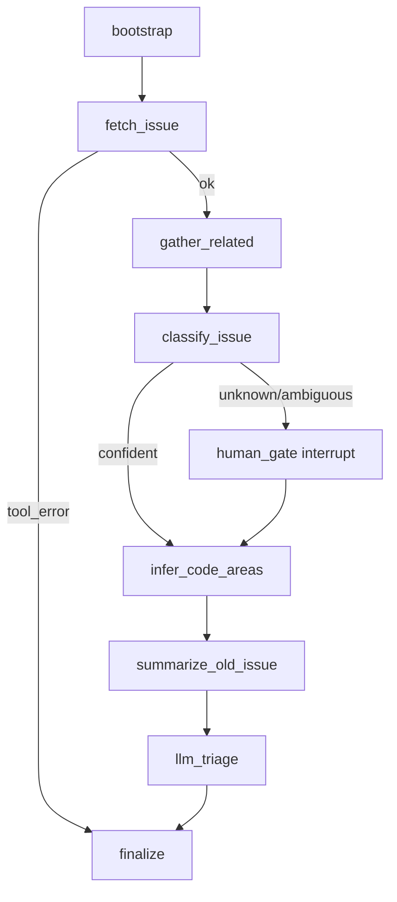

# Final Report - GitHub Issue Triage Agent

## Track and Goal
This project implements Track C: a GitHub issue triage agent. The agent receives a public repository and issue number, retrieves GitHub evidence through MCP tools, and produces a structured triage state with classification, related issues, likely code areas, open questions, decision needed, evidence ids, tool events, and stop reason.

## Agent Specification
Target user: a repository maintainer reviewing incoming or stale GitHub issues.

Inputs:
- `repo`: repository in `owner/name` form.
- `issue_number`: GitHub issue number.
- optional human reviewer decision at the interrupt gate.

Outputs:
- `classification`: `bug`, `feature request`, `question`, `documentation`, `duplicate`, or `unknown`.
- `justification`: evidence-grounded rationale.
- `related_issues`: up to 3 related or duplicate candidates.
- `probable_code_areas`: likely modules or paths.
- `current_state_summary`, `open_questions`, `decision_needed`.
- `evidence_ids`, `tool_events`, `stop_reason`.

Success means the trajectory uses the expected tool classes, grounds claims in retrieved evidence, avoids cross-repository duplicate suggestions, and escalates uncertainty instead of inventing details.

## Architecture
The chosen architecture is a single LangGraph `StateGraph` with a bounded tool loop and a human-in-the-loop gate. A supervisor/worker setup was considered, but rejected because the triage tasks are short and benefit more from transparent state transitions than from extra coordination.



Implementation references:
- State schema: `src/agent/state.py`
- Graph: `src/agent/graph.py`
- LLM adapter: `src/agent/llm.py`

## MCP Tooling
Custom MCP server: `src/mcp_custom/server.py`
- `github_get_issue(repo, issue_number)`: fetches issue metadata from GitHub REST.
- `github_search_related_issues(repo, query, limit)`: searches same-repo issues for related or duplicate candidates.
- `github_get_issue_timeline(repo, issue_number, per_page)`: fetches issue timeline events.
- `triage_cache_get(key, max_age_sec)`: reads cached JSON from SQLite.
- `triage_cache_put(key, value_json)`: writes JSON to SQLite cache.

Third-party MCP servers:
- Filesystem MCP: configured for local artifact access.
- Git MCP (`@cyanheads/git-mcp-server`): used by eval to `git_add`, `git_commit`, and `git_push` generated JSON artifacts.

The custom MCP server runs out-of-process and wraps the primary Track C data source. It also performs local bookkeeping through SQLite caching.

## Evaluation Set
The evaluation set contains 33 tasks in `data/eval_tasks.jsonl`, including classification, duplicate search, ambiguous escalation, stale issue summarization, code-area inference, and 3 adversarial tasks:
- nonexistent repository,
- nonexistent issue,
- prompt-injection-style instruction in issue content.

Each task includes expected tool classes, forbidden behaviors, and a 3-point rubric.

## Baseline Results
Baseline summary from `reports/eval_summary.json`:

| Metric | Value |
| --- | ---: |
| Tasks | 33 |
| Mean score / 3 | 2.909 |
| Score counts | 30 at 3, 3 at 2 |
| Tool-selection accuracy | 0.909 |
| Mean steps | 6.333 |
| Mean tool calls | 4.061 |
| Mean latency seconds | 25.273 |
| Total tokens | 3598 |
| Estimated USD cost | 0.0 for local Ollama |
| Ungrounded claims | 0 |
| Hallucinated tool args | 0 |

Stop reasons:
- `completed`: 27
- `None`: 4
- `tool_error_non_retriable`: 2

## Trajectory Analysis
Machine-readable trajectories are written under `runs/main/trajectories`. Each trajectory contains the task, final state, evidence, tool events, and metrics.

Annotated failures are generated with:

```bash
make failure-traces
```

Current failure modes:
- Tool-selection accounting misses when GitHub data is served from cache and expected live tool classes are not reflected in `tool_events`.
- Adversarial prompt-injection task did not record expected defensive tool usage.
- GitHub unauthenticated rate limit appeared as a non-retriable `403`.

See `reports/failure_traces.md` for the three annotated examples.

## Ablation Study
The ablation runner is implemented in `src/eval/run_ablations.py` and runs the same eval set under four variants:

- `baseline`: primary model, strict prompt, baseline graph.
- `model_secondary`: secondary model, same prompt and graph.
- `prompt_permissive`: weaker prompt, same model and graph.
- `graph_no_human_gate`: bypasses the HITL gate, same model and prompt.

Run with:

```bash
make ablations
```

Expected outputs:
- `reports/ablations/ablation_results.json`
- `reports/ablations/ablation_study.md`
- `runs/ablations/<variant>/`

A smoke/sample ablation run with `--limit 3` has been generated. All four variants completed, but the sample was dominated by GitHub `tool_error_non_retriable` stops, so the metrics primarily expose a rate-limit/data-access failure rather than meaningful model or graph differences. Full ablation results should be regenerated with `GITHUB_TOKEN` configured, or from a sufficiently warm request-key cache, before final submission.

Sample ablation output:

| Variant | n | Mean score | Tool accuracy | Stop pattern |
| --- | ---: | ---: | ---: | --- |
| baseline | 3 | 1.0 | 0.667 | all `tool_error_non_retriable` |
| model_secondary | 3 | 1.0 | 0.667 | all `tool_error_non_retriable` |
| prompt_permissive | 3 | 1.0 | 0.667 | all `tool_error_non_retriable` |
| graph_no_human_gate | 3 | 1.0 | 0.667 | all `tool_error_non_retriable` |

## Cost and Latency Control
Per-run caps are encoded in `TriageState`:
- `max_steps = 16`
- `max_tool_calls = 12`
- `max_wall_clock_sec = 45`
- `max_token_budget = 4000`
- `max_retries_per_tool = 2`

The current model path uses local Ollama/Qwen, so estimated USD cost is reported as `0.0`. Hosted-model experiments should update cost accounting with provider token prices.

## Limitations and Future Work
- Full ablation metrics need to be generated with `make ablations`.
- Trajectories log final state and tool events, but do not yet capture every model input/output at each step.
- GitHub rate-limit `403` should be inspected by response body and treated as retriable when appropriate.
- Cache hits should also count toward expected tool-class usage or be represented as cached tool events.
- A final grounding validator could map every final claim to evidence ids.
