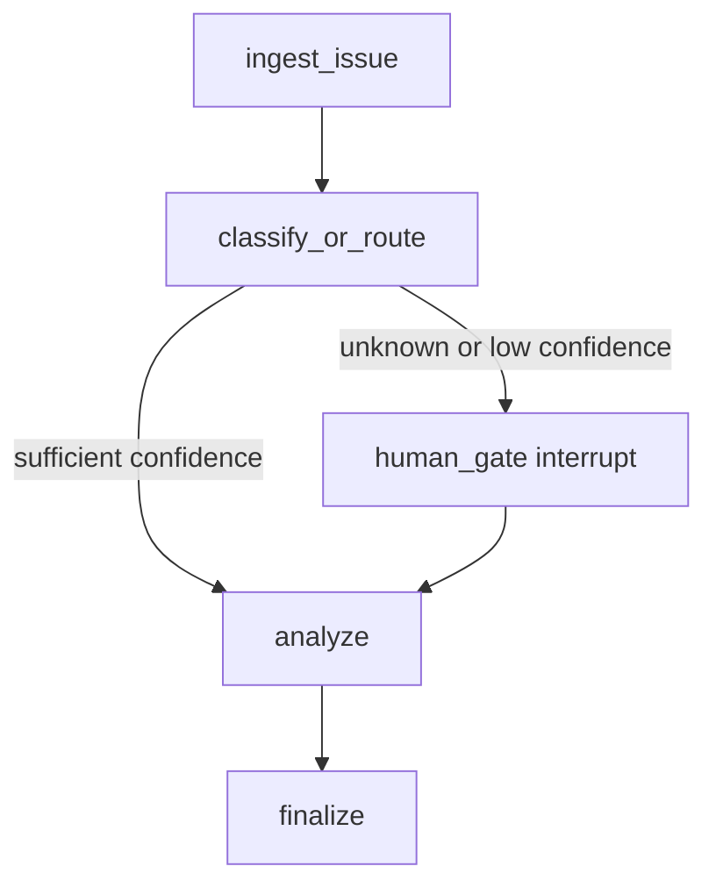

```mermaid
graph TD
  A[ingest_issue] --> B[classify_or_route]
  B -->|unknown or low confidence| C[human_gate interrupt]
  B -->|sufficient confidence| D[analyze]
  C --> D
  D --> E[finalize]
```
